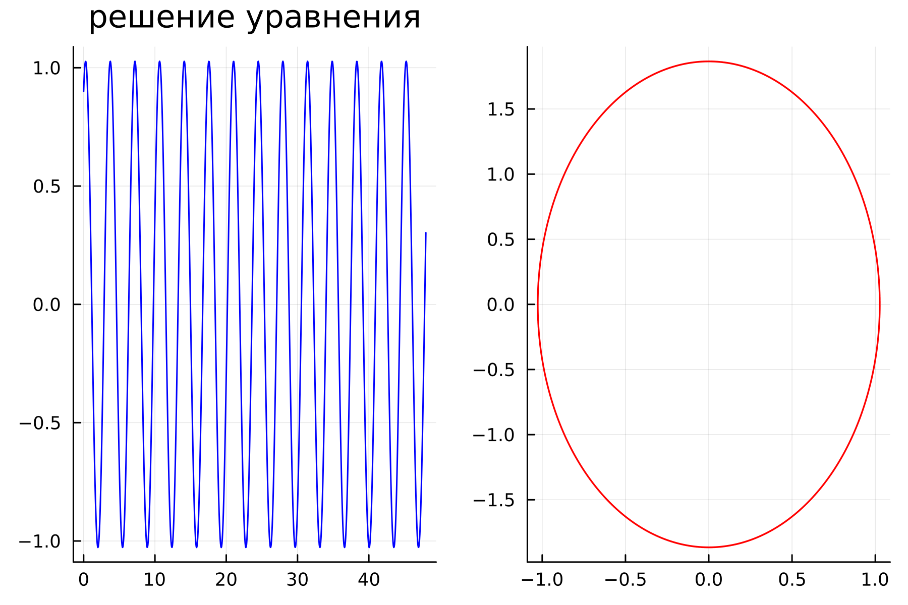
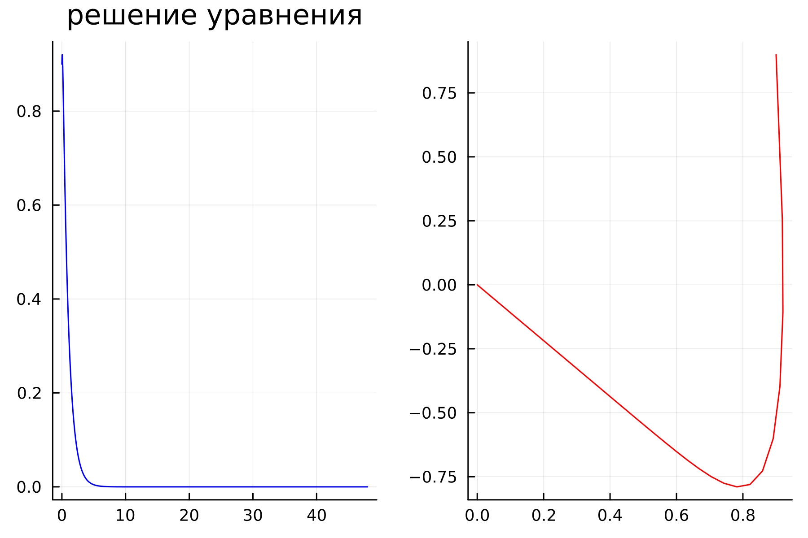
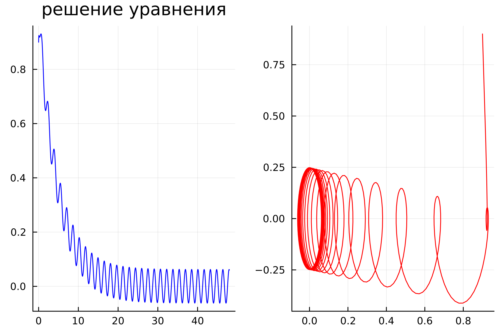

---
## Front matter
title: "Отчёт по лабораторной работе 4"
subtitle: "Простейший вариант 54"
author: "Еленга Невлора Люглеш"

## Generic otions
lang: ru-RU
toc-title: "Содержание"

## Bibliography
bibliography: bib/cite.bib
csl: pandoc/csl/gost-r-7-0-5-2008-numeric.csl

## Pdf output format
toc: true # Table of contents
toc-depth: 2
lof: true # List of figures
lot: true # List of tables
fontsize: 12pt
linestretch: 1.5
papersize: a4
documentclass: scrreprt
## I18n polyglossia
polyglossia-lang:
  name: russian
  options:
	- spelling=modern
	- babelshorthands=true
polyglossia-otherlangs:
  name: english
## I18n babel
babel-lang: russian
babel-otherlangs: english
## Fonts
mainfont: PT Serif
romanfont: PT Serif
sansfont: PT Sans
monofont: PT Mono
mainfontoptions: Ligatures=TeX
romanfontoptions: Ligatures=TeX
sansfontoptions: Ligatures=TeX,Scale=MatchLowercase
monofontoptions: Scale=MatchLowercase,Scale=0.9
## Biblatex
biblatex: true
biblio-style: "gost-numeric"
biblatexoptions:
  - parentracker=true
  - backend=biber
  - hyperref=auto
  - language=auto
  - autolang=other*
  - citestyle=gost-numeric
## Pandoc-crossref LaTeX customization
figureTitle: "Рис."
tableTitle: "Таблица"
listingTitle: "Листинг"
lofTitle: "Список иллюстраций"
lotTitle: "Список таблиц"
lolTitle: "Листинги"
## Misc options
indent: true
header-includes:
  - \usepackage{indentfirst}
  - \usepackage{float} # keep figures where there are in the text
  - \floatplacement{figure}{H} # keep figures where there are in the text
---

# Цель работы

Построить фазовый портрет гармонического осциллятора и решить уравнения гармонического осциллятора.

# Задание

Вариант № 54 

Постройте фазовый портрет гармонического осциллятора и решение уравнения гармонического осциллятора для следующих случаев  

1. Колебания гармонического осциллятора без затуханий и без действий внешней силы $$ \ddot{x}+9.9x=0 $$

2. Колебания гармонического осциллятора c затуханием и без действий внешней силы 13x+13x+13x=0  $$ \ddot{x}+13\dot{x}+13x=0 $$

3. Колебания гармонического осциллятора c затуханием и под действием внешней силы   $$ \ddot{x}+24\dot{x}+25x=6sin(4t) $$ 

На интервале $$ t\in [0; 48] $$ (шаг 0,05) с начальными условиями  $$ x_0=0,9,y_0=0,9 $$


# Выполнение лабораторной работы

 Решение

Движение грузика на пружинке, маятника, заряда в электрическом контуре, а также эволюция во времени многих систем в физике, химии, биологии и других науках при определенных предположениях можно описать одним и тем же дифференциальным уравнением, которое в теории колебаний выступает в качестве основной модели. Эта модель называется линейным гармоническим осциллятором. 
Уравнение свободных колебаний гармонического осциллятора имеет следующий вид: 
    $$ \ddot{x}+2\gamma\dot{x}+w_0^2x=0 $$ 

Это уравнение есть линейное однородное дифференциальное уравнение второго порядка и оно является примером линейной динамической системы.

При отсутствии потерь в системе вместо этого уравнения получаем уравнение консервативного осциллятора энергия колебания которого сохраняется во времени:  
    $$ \ddot{x}+w_0^2x=0 $$

Для однозначной разрешимости уравнения второго порядка необходимо задать два начальных условия вида: 
    $$ x(t_0)=x_0;  \dot{x}(t_0)=y_0 $$

Уравнение второго порядка можно представить в виде системы двух уравнений первого порядка: 
    $$ \dot{x}=y;  \dot{y}=-w_0^2x $$

Начальные условия для системы примут вид: 
    $$ x(t_0)=x_0;  y(t_0)=y_0 $$

Независимые переменные x, y определяют пространство, в котором «движется» решение. Это фазовое пространство системы, поскольку оно двумерно будем называть его фазовой плоскостью.

Значение фазовых координат x, y в любой момент времени полностью определяет состояние системы. Решению уравнения движения как функции времени отвечает гладкая кривая в фазовой плоскости. Она называется фазовой траекторией. Если множество различных решений (соответствующих различным начальным условиям) изобразить на одной фазовой плоскости, возникает общая картина поведения системы. Такую картину, образованную набором фазовых траекторий, называют фазовым портретом.

# код
1.Случай 1

julia
```
using Plots
using DifferentialEquations

w = 3.3  #значение параметра омега(w^2=9.9)
g = 0.0
x0 = 0.9  #начальное значение
y0 = 0.9  #начальное значение

function ode_f(du, u, p, t)
   x, y = u
   du[1] = u[2]    #уравнение системы
   du[2] = -w*u[1] - g*u[2]   #уравнение системы
end

v0 = [x0, y0]
tspan = [0.0, 48.0]
prob1 = ODEproblem(ode_f, v0, tspan )
sol1 = solve(prob1, dtmax=0.05)
X = [u[1] for u in sol1.u]
Y = [u[2] for u in sol1.u]
T = [t for t in sol1.t]

p = plot(
    layout=(1,2),
    dpi=30,
    legend=false)
plot!(p[1], 
      T, 
      X,
      title="решение уравнение"
      color=:blue)
plot!(p[1], 
      X, 
      Y,
      label="фазовый портрет"
      color=:blue)
      savefig("lab4modeli-1.png")
```

График для первого случая (рис.1):

{#fig:001 width=70%}


2.Случай 2

julia
```
using Plots
using DifferentialEquations

w = 3.60  #значение параметра омега(w^2=13)
g = 13
x0 = 0.9  #начальное значение"
y0 = 0.9  #начальное значение"

function ode_f(du, u, p, t)
   x, y = u
   du[1] = u[2]    #уравнение системы
   du[2] = -w*u[1] - g*u[2]   #уравнение системы
end

v0 = [x0, y0]
tspan = [0.0, 48.0]
prob2 = ODEproblem(ode_f, v0, tspan )
sol2 = solve(prob2, dtmax=0.05)
X = [u[1] for u in sol1.u]
Y = [u[2] for u in sol1.u]
T = [t for t in sol1.t]

p = plot(
    layout=(1,2),
    dpi=30,
    legend=false)
plot!(p[1], 
      T, 
      X,
      title="решение уравнение"
      color=:red)
plot!(p[1], 
      X, 
      Y,
      label="фазовый портрет"
      color=:blue)
      savefig("lab4modeli-2.png")
```

График для второго случая (рис.2):

{#fig:002 width=70%}

3.Случай 3

График для второго случая (рис.3):
```
using Plots
using DifferentialEquations

w = 5.0  #значение параметра омега(w^2=25)
g = 24.0
x0 = 0.9  #3начальное значение
y0 = 0.9  #начальное значение

function ode_f(du, u, p, t)
   x, y = u
   du[1] = u[2]    #уравнение системы
   du[2] = -w*u[1] - g*u[2]  + 6*sin(4*t) #уравнение системы
end

v0 = [x0, y0]
tspan = [0.0, 48.0]
prob3 = ODEproblem(ode_f, v0, tspan )
sol3 = solve(prob3, dtmax=0.05)
X = [u[1] for u in sol1.u]
Y = [u[2] for u in sol1.u]
T = [t for t in sol1.t]

p = plot(
    layout=(1,2),
    dpi=300,
    legend=false)
plot!(p[1], 
      T, 
      X,
      title="решение уравнение"
      color=:red)
plot!(p[1], 
      X, 
      Y,
      label="фазовый портрет"
      color=:yellow)
      savefig("lab4modeli-3.png")
```
{#fig:002 width=70%}

# Выводы

В ходе выполнения лабораторной работы я научилась строить фазовый портрет гармонического осциллятора и решать уравнения гармонического осциллятора.

# Ответы на вопросы

1.Простейшим видом колебательного процесса являются простые гармонические колебания, описывающиеся уравнением: 
    $$ x = x_m cos (ωt + φ_0) $$  
где x — смещение тела от положения равновесия, 
x_m — амплитуда колебаний, 
ω — циклическая или круговая частота, 
t — время.

2.Осциллятор — система, совершающая колебания, то есть показатели которой периодически повторяются во времени.

3. Модель математического маятника
$$ \frac{d^2\alpha}{d t^2}+\frac{g}{L}\alpha=0  или   \frac{d^2\alpha}{dt^2}+\omega^2\alpha=0 $$ 

4.Дифференциальное уравнение второго порядка: 
    $$ \ddot{x}+w_0^2x=f(t) $$
Замена: 
    $$ y=\dot{x} $$
Полученная система уравнений: 
    $$ y =\dot{x};\dot{y}=-w_0^2x $$

5.Фазовый портрет — это полная совокупность различных фазовых траекторий.


Фазовая траектория — кривая в фазовом пространстве, составленная из точек, представляющих состояние динамической системы в последовательные моменты времени в течение всего времени эволюции.

# Список литературы

Кулябов Д. С. Лабораторная работа №4:
https://esystem.rudn.ru/course/view.php?id=5930#section-9

