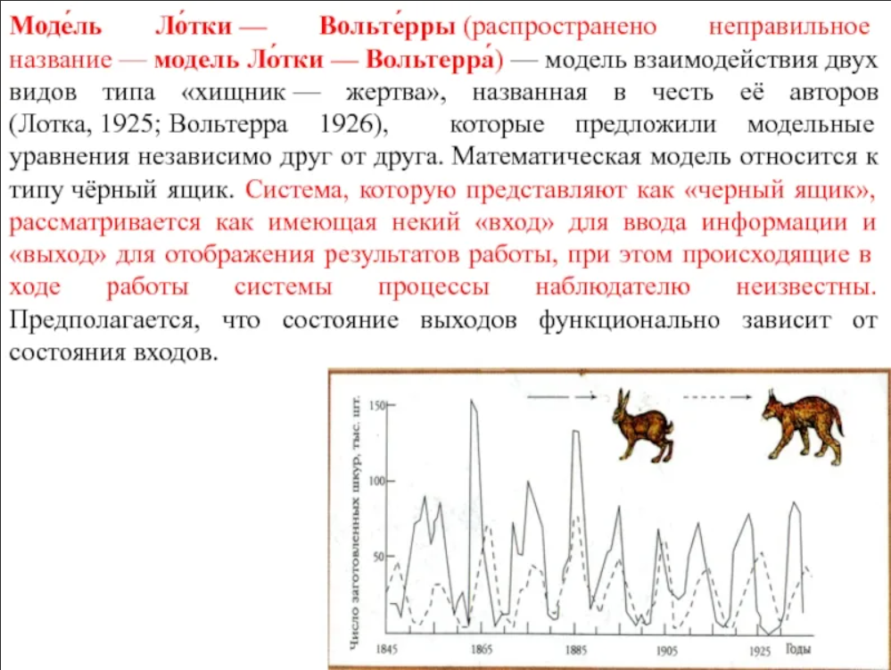
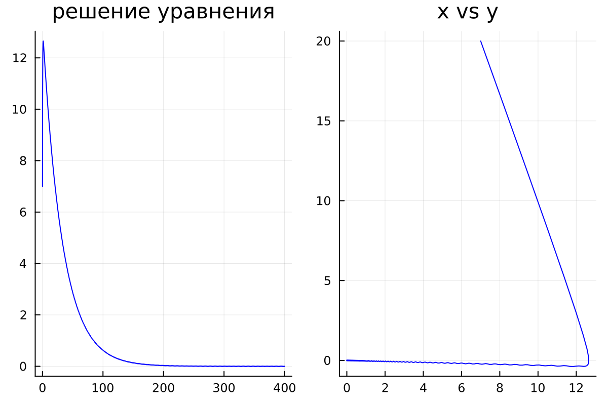
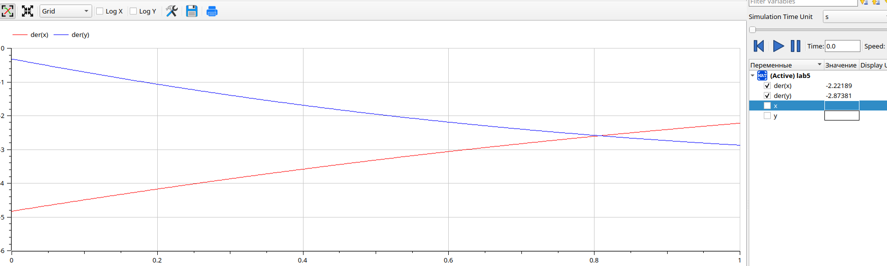

---
## Front matter
lang: ru-RU
title: Презентация к лабораторной работе  5
subtitle: Простейший шаблон
author:
  - Еленга Невлора Люглеш.
institute:
  - Российский университет дружбы народов, Москва, Россия
  - Факультет физико-математических и естественных наук, Москва, Россия
date: 15 февраля 2023

## i18n babel
babel-lang: russian
babel-otherlangs: english

## Formatting pdf
toc: false
toc-title: Содержание
slide_level: 2
aspectratio: 169
section-titles: true
theme: metropolis
header-includes:
 - \metroset{progressbar=frametitle,sectionpage=progressbar,numbering=fraction}
 - '\makeatletter'
 - '\beamer@ignorenonframefalse'
 - '\makeatother'
---

# Информация

## Докладчик

:::::::::::::: {.columns align=center}
::: {.column width="70%"}

  * Еленга Невлора Люглеш
  * Студент 3-го курса
  * Группа НКНбд-01-20
  * Российский университет дружбы народов
  * 1032205073
  * <https://github.com/Newlora501>

# Вводная часть

## Актуальность

Модель Лотки-Вольтерры — модель взаимодействия двух видов типа «хищник — жертва», названная в честь её авторов, которые предложили модельные уравнения независимо друг от друга. Такие уравнения можно использовать для моделирования систем «хищник — жертва», «паразит — хозяин», конкуренции и других видов взаимодействия между двумя видами.
{#fig:001 width=70%}

## Цели и задачи

- Научиться работать с OpenModelica и julia

- Построить график зависимости численности хищников от численности жертв

- Построить графики изменения численности хищников и численности жертв при заданных начальных условиях

- Найти стационарное состояние системы

## Задачи

Для модели «хищник-жертва»:
  $$ dx/dt=-0,13x(t)+0,041x(t)y(t);dy/dt=0,31y(t)-0,042x(t)y(t) $$
Постройте график зависимости численности хищников от численности жертв,
а также графики изменения численности хищников и численности жертв при следующих начальных условиях:
  $$ x_0=7,y_0=20 $$ 
Найдите стационарное
состояние системы.

## Содержание исследования

- Познакомиться с моделью Лотки-Вольтерры

- Научиться строить фазовый портрет системы с помощью OpenModelica и julia

- Описание код и построение графику

## Полученные график
{#fig:001 width=70%}
{#fig:001 width=70%}

стационарное состояние системы: $$ x_0=0,31/0,042=7,38;  y_0=0,13/0,041=3,17 $$

## Результаты

- Мы научились работать в OpenModelica и Julia

- Научились строить график зависимости численности хищников от численности жертв

- Научились строить графики изменения численности хищников и численности жертв при заданных начальных условиях

- Научились находить стационарное состояние системы

## Итоговый слайд

- СПАСИБО ЗА ВИНИМАНИЕ
