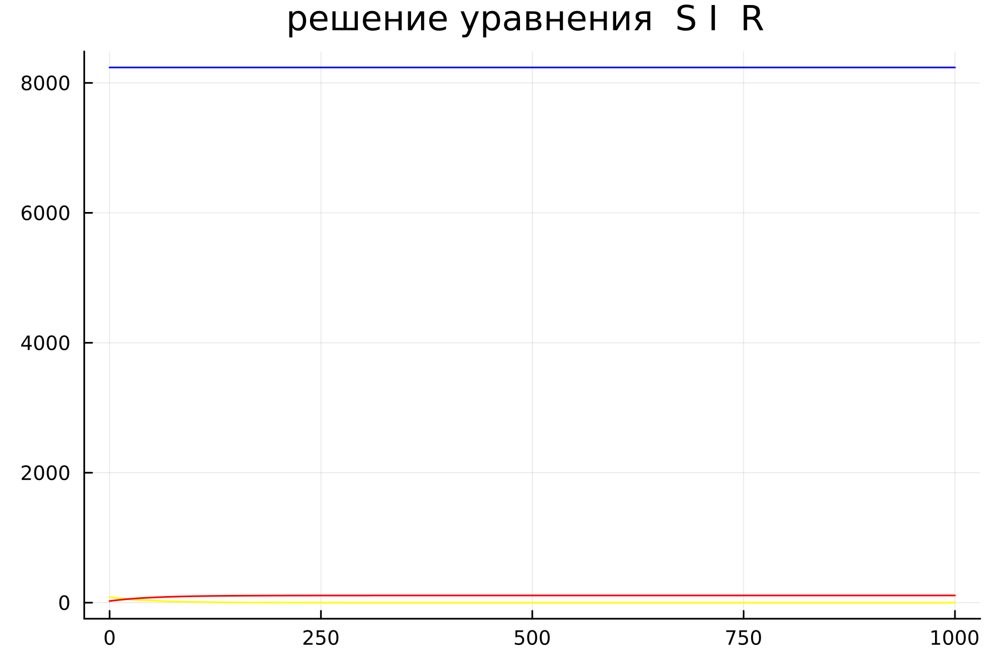
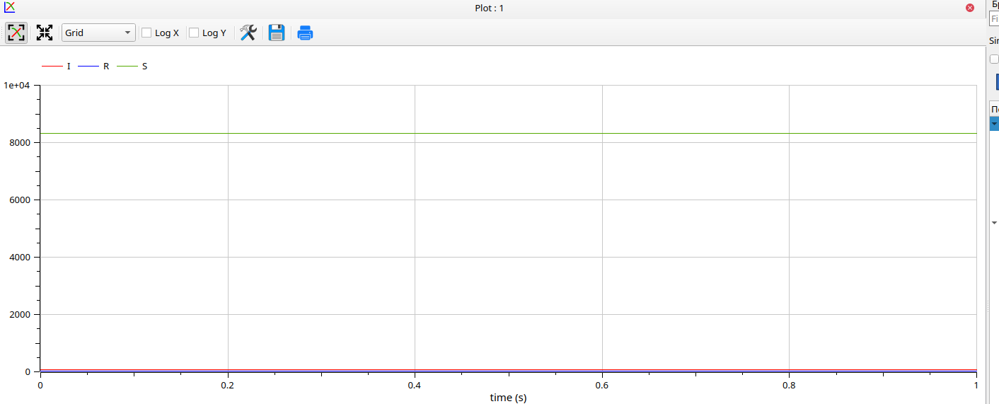
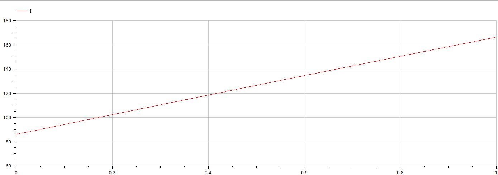
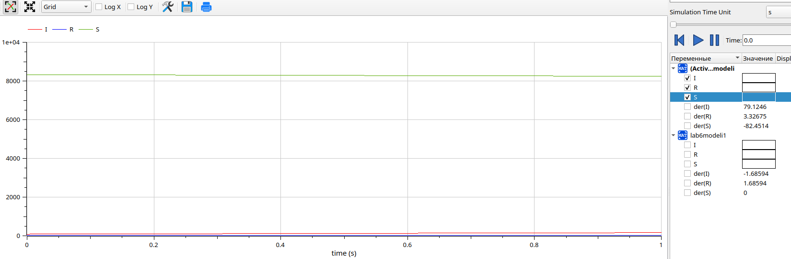

---
## Front matter
lang: ru-RU
title: Презентация к лабораторной работе  6
subtitle: Простейший шаблон
author:
  - Еленга Невлора Люглеш.
institute:
  - Российский университет дружбы народов, Москва, Россия
  - Факультет физико-математических и естественных наук, Москва, Россия
date: 15 февраля 2023

## i18n babel
babel-lang: russian
babel-otherlangs: english

## Formatting pdf
toc: false
toc-title: Содержание
slide_level: 2
aspectratio: 169
section-titles: true
theme: metropolis
header-includes:
 - \metroset{progressbar=frametitle,sectionpage=progressbar,numbering=fraction}
 - '\makeatletter'
 - '\beamer@ignorenonframefalse'
 - '\makeatother'
---

# Информация

## Докладчик

:::::::::::::: {.columns align=center}
::: {.column width="70%"}

  * Еленга Невлора Люглеш
  * Студент 3-го курса
  * Группа НКНбд-01-20
  * Российский университет дружбы народов
  * 1032205073
  * <https://github.com/Newlora501>

# Вводная часть

## Актуальность

В 1927 году, WO Kermack и AG Маккендрик создали модель , в которой они считали фиксированное население только с тремя отделениями: восприимчивыми, ; инфицированных, ; и извлекают, . В данной модели используются отсеки трех классов: 
- S(t) используется для представления людей, еще не инфицированных заболеванием в момент времени t, или людей, восприимчивых к заболеванию в популяции. 
- I(t) обозначает людей из населения, которые были инфицированы этим заболеванием и способны распространить болезнь среди лиц, относящихся к уязвимой категории. 
- R(t) это отделение, используемое для людей из популяции, которые были инфицированы, а затем удалены от болезни, либо из-за иммунизации, либо из-за смерти. Люди из этой категории не могут снова заразиться или передать инфекцию другим. Математическое моделирование инфекционного заболевания .

## Цели 
- Научиться работать с OpenModelica и Julia

- Построить графики изменения числа особей в группах с помощью простейшей модели эпидемии

- Рассмотреть, как будет протекать эпидемия в различных случаях

- Получение новых знаний в ходе выполнения лабораторной работы

## Задачи

На одном острове вспыхнула эпидемия. Известно, что из всех проживающих на острове (N=8 439) в момент начала эпидемии (t=0) число заболевших людей (являющихся распространителями инфекции) I(0)=86,  А число здоровых людей с иммунитетом к болезни R(0)=25. Таким образом, число людей восприимчивых к болезни, но пока здоровых, в начальный момент времени S(0)=N-I(0)- R(0).  Постройте графики изменения числа особей в каждой из трех групп. Рассмотрите, как будет протекать эпидемия в случае:  
1) если  $$ I(0)\leq I^* $$
2) если $$ I(0)>I^* $$

## Содержание исследования

- Познакомиться с простейшей моделью эпидемии

- Научиться строить графики изменения числа особей в группах с помощью OpenModelica

- Описание код и построение графику

- Применение полученных знаний на практике в дальнейшем

## Полученные график
1) Cлучай, когда $$ I(0)\leq I^* $$
{#fig:001 width=70%}
{#fig:001 width=70%}

2) Cлучай, когда  $$ I(0)>I^* $$
{#fig:001 width=70%}
{#fig:001 width=70%}
{#fig:001 width=70%}

## Результаты

- Мы научились работать в OpenModelica и Julia

- Научились строить графики изменения числа особей в группах с помощью простейшей модели эпидемии

- Рассмотрели, как будет протекать эпидемия в различных случаях

## Итоговый слайд

- СПАСИБО ЗА ВИНИМАНИЕ
