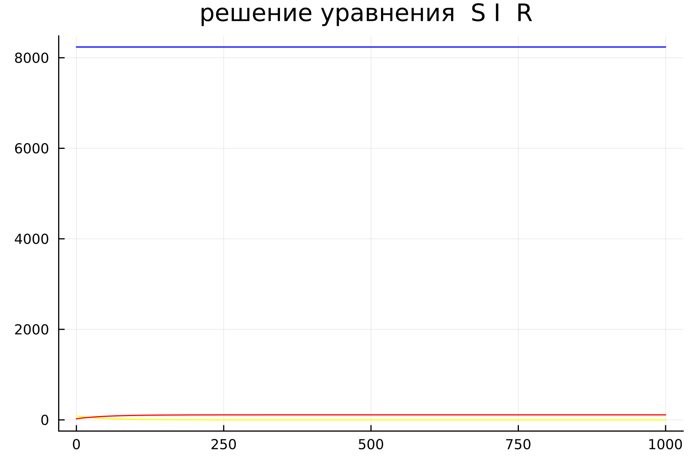
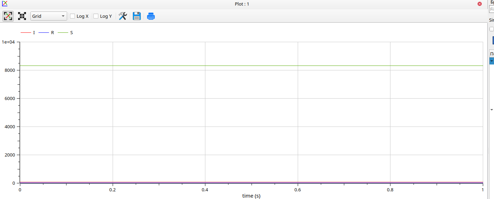
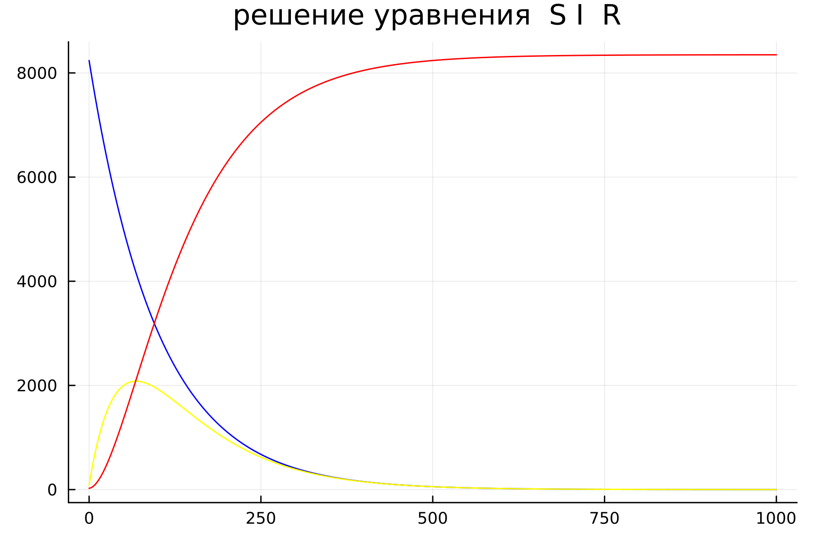
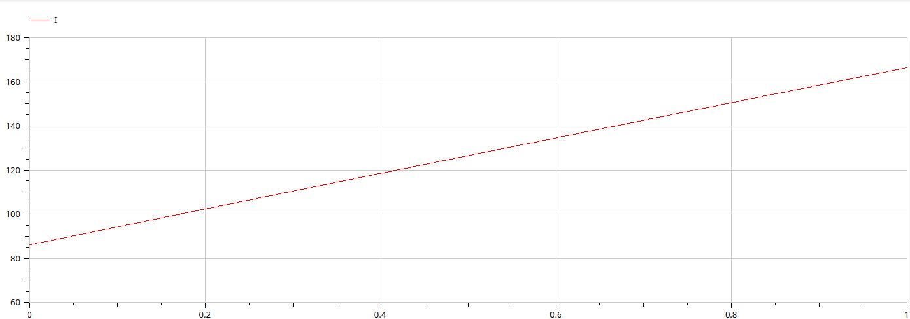
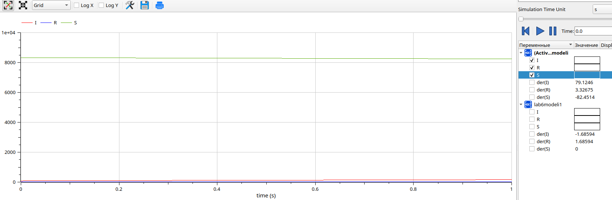

---
## Front matter
title: "Отчёт по лабораторной работе 6"
subtitle: "Простейший вариант 54"
author: "Еленга Невлора Люглеш"

## Generic otions
lang: ru-RU
toc-title: "Содержание"

## Bibliography
bibliography: bib/cite.bib
csl: pandoc/csl/gost-r-7-0-5-2008-numeric.csl

## Pdf output format
toc: true # Table of contents
toc-depth: 2
lof: true # List of figures
lot: true # List of tables
fontsize: 12pt
linestretch: 1.5
papersize: a4
documentclass: scrreprt
## I18n polyglossia
polyglossia-lang:
  name: russian
  options:
	- spelling=modern
	- babelshorthands=true
polyglossia-otherlangs:
  name: english
## I18n babel
babel-lang: russian
babel-otherlangs: english
## Fonts
mainfont: PT Serif
romanfont: PT Serif
sansfont: PT Sans
monofont: PT Mono
mainfontoptions: Ligatures=TeX
romanfontoptions: Ligatures=TeX
sansfontoptions: Ligatures=TeX,Scale=MatchLowercase
monofontoptions: Scale=MatchLowercase,Scale=0.9
## Biblatex
biblatex: true
biblio-style: "gost-numeric"
biblatexoptions:
  - parentracker=true
  - backend=biber
  - hyperref=auto
  - language=auto
  - autolang=other*
  - citestyle=gost-numeric
## Pandoc-crossref LaTeX customization
figureTitle: "Рис."
tableTitle: "Таблица"
listingTitle: "Листинг"
lofTitle: "Список иллюстраций"
lotTitle: "Список таблиц"
lolTitle: "Листинги"
## Misc options
indent: true
header-includes:
  - \usepackage{indentfirst}
  - \usepackage{float} # keep figures where there are in the text
  - \floatplacement{figure}{H} # keep figures where there are in the text
---

# Цель работы

Построить графики изменения числа особей в группах с помощью простейшей модели эпидемии и рассмотреть, как будет протекать эпидемия в различных случаях.

# Теоретическая справка

Предположим, что некая популяция, состоящая из N особей, (считаем, что популяция изолирована) подразделяется на три группы. Первая группа - это восприимчивые к болезни, но пока здоровые особи, обозначим их через S(t). Вторая группа – это число инфицированных особей, которые также при этом являются распространителями инфекции, обозначим их I(t). А третья группа, обозначающаяся через R(t) – это здоровые особи с иммунитетом к болезни.

До того, как число заболевших не превышает критического значения I* , считаем, что все больные изолированы и не заражают здоровых. Когда I(t)>I*, тогда инфицирование способны заражать восприимчивых к болезни особей. Таким образом, скорость изменения числа S(t) меняется по следующему закону: $$ \frac{\partial S}{\partial t}=\begin{cases}-\alpha S,если\ I(t)>I^*;\ 0, если\ I(t)\leq I^*\end{cases} $$ 
Поскольку каждая восприимчивая к болезни особь, которая, в конце концов, заболевает, сама становится инфекционной, то скорость изменения числа инфекционных особей представляет разность за единицу времени между заразившимися и теми, кто уже болеет и лечится, т.е.: $$ \frac{\partial I}{\partial t}=\begin{cases}\alpha S-\beta I,если\ I(t)>I^*;\ -\beta I,если\ I(t)\leq I^*\end{cases} $$  А скорость изменения выздоравливающих особей (при этом приобретающие иммунитет к болезни): $$ \frac{\partial R}{\partial t}=\beta I $$ Постоянные пропорциональности $$ \alpha,\beta $$ это коэффициенты заболеваемости и выздоровления соответственно.

Для того, чтобы решения соответствующих уравнений определялось однозначно, необходимо задать начальные условия .Считаем, что на начало эпидемии в момент времени t=0 нет особей с иммунитетом к болезни R(0)=0, а число инфицированных и восприимчивых к болезни особей I(0) и S(0) соответственно. Для анализа картины протекания эпидемии необходимо рассмотреть два случая: 

$$ I(0)>I^*;I(0)\leq I^* $$

# Задание

Формула определения номера задания: (SnmodN)+1, где Sn — номер студбилета, N — количество заданий.

Вариант 54

На одном острове вспыхнула эпидемия. Известно, что из всех проживающих на острове (N=8 439) в момент начала эпидемии (t=0) число заболевших людей (являющихся распространителями инфекции) I(0)=86,  А число здоровых людей с иммунитетом к болезни R(0)=25. Таким образом, число людей восприимчивых к болезни, но пока здоровых, в начальный момент времени S(0)=N-I(0)- R(0).  Постройте графики изменения числа особей в каждой из трех групп. Рассмотрите, как будет протекать эпидемия в случае:  
1) если  $$ I(0)\leq I^* $$
2) если $$ I(0)>I^* $$


# Выполнение лабораторной работы

 

## код
## Julia
1) Cлучай, когда $$ I(0)\leq I^* $$

```
using Plots
using DifferentialEquations

a = 0.01
b = 0.02
N = 8439
I0 = 86
R0 = 25
S0 = N - I0 - R0

"случай, когда I(0)<=I* "
function ode_fn(du, u, p, t)
    s, i, r = u
    du[1] = 0
    du[2] = - b*u[2]
    du[3] = b*u[2]
end

u0 = [S0, I0, R0]
tspan = (0.0, 1000.0)
prob1 = ODEProblem(ode_fn, u0, tspan)
sol1 = solve(prob1, dtmax=0.01)

S = [u[1] for u in sol1.u]
I = [u[2] for u in sol1.u]
R = [u[3] for u in sol1.u]
T = [t for t in sol1.t]

plt = 
    plot(
        layout=(1),
        dpi=300,
        legend=false)
    plot!(
        plt[1],
        T,
        S,
        title="решение уравнения ",
        color=:blue)
    plot!(
        plt[1],
        T,
        I,
        label="S I R",
        color=:yellow)
    plot!(
        plt[1],
        T,
        R,
        label="решение уравнения S I  R",
        color=:red)

        savefig("lab6-1.png")
```
{#fig:001 width=70%}

## Openmodelica

```
model lab6modeli1
constant Real b=0.02; ///коэффициент выздоровления
constant Real N=8439; // общая численность популяции

Real I;
Real R;
Real S;

initial equation
I=86; // количество инфицированных особей в начальный момент времени
R=25; // количество здоровых особей с иммунитетом в начальный момент времени
S=N-I-R; // количество восприимчивых к болезни особей в начальный момент времени

// случай, когда I(0)<=I*
equation
der(S)=0;
der(I)=-b*I;
der(R)=b*I;

end lab6modeli1;
```
@fig:001).

{#fig:001 width=70%}

2) Cлучай, когда  $$ I(0)>I^* $$
## Julia
```
using Plots
using DifferentialEquations

a = 0.01
b = 0.02
N = 8439
I0 = 86
R0 = 25
S0 = N - I0 - R0

"случай, когда I(0)>I* "
function ode_fn(du, u, p, t)
    s, i, r = u
    du[1] = -a*u[1]
    du[2] = a*u[1] - b*u[2]
    du[3] = b*u[2]
end

u0 = [S0, I0, R0]
tspan = (0.0, 1000.0)
prob1 = ODEProblem(ode_fn, u0, tspan)
sol1 = solve(prob1, dtmax=0.01)

S = [u[1] for u in sol1.u]
I = [u[2] for u in sol1.u]
R = [u[3] for u in sol1.u]
T = [t for t in sol1.t]

plt = 
    plot(
        layout=(1),
        dpi=300,
        legend=false)
    plot!(
        plt[1],
        T,
        S,
        title="решение уравнения ",
        color=:blue)
    plot!(
        plt[1],
        T,
        I,
        label="S I R",
        color=:yellow)
    plot!(
        plt[1],
        T,
        R,
        label="решение уравнения S I  R",
        color=:red)

        savefig("lab6-2.png")
```
{#fig:001 width=70%}

## Openmodelica

```
model lab6modeli

constant Real a=0.01;//коэффицент заболевания
constant Real b=0.02;//коэфицент выздоровления 
constant Real N=6666;//количество проживающих на острове

Real I;//инфицированные особи
Real R;//здоровые особи с иммунитетом к болезни 
Real S;//здоровые особи, восприимчивые к болезни

initial equation 
I=83;//количество инфицированных особей
R=6;//количество здоровых особей с иммунитетом к болезни 
S=N-I-R;//количество здоровых особей, восприимчивых к болезни

equation 
der(S)=-a*S;//изменение количества здоровых особей, восприимчивых к болезни
der(I)=a*S-b*I;//изменение количества инфицированных особей
der(R)=b*I;//изменение количества здоровых особей с иммунитетом 

end lab6modeli;
```
@fig:001).

{#fig:001 width=70%}
{#fig:001 width=70%}


# Выводы

В ходе выполнения лабораторной работы я научилась строить графики изменения числа особей в группах с помощью простейшей модели эпидемии.

# Список литературы

Кулябов Д. С. Лабораторная работа №6:
chrome-extension://efaidnbmnnnibpcajpcglclefindmkaj/https://esystem.rudn.ru/pluginfile.php/1971578/mod_resource/content/2/%D0%9B%D0%B0%D0%B1%D0%BE%D1%80%D0%B0%D1%82%D0%BE%D1%80%D0%BD%D0%B0%D1%8F%20%D1%80%D0%B0%D0%B1%D0%BE%D1%82%D0%B0%20%E2%84%96%205.pdf

