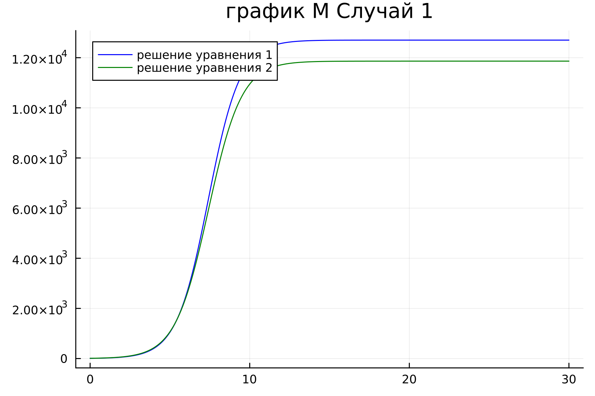
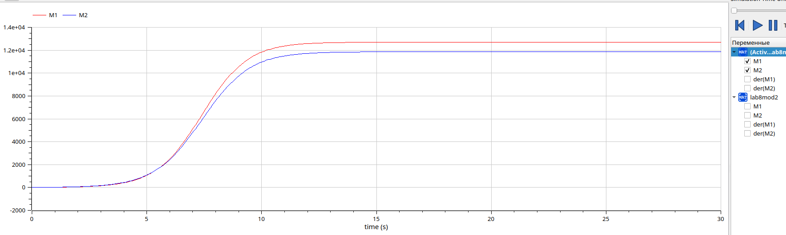
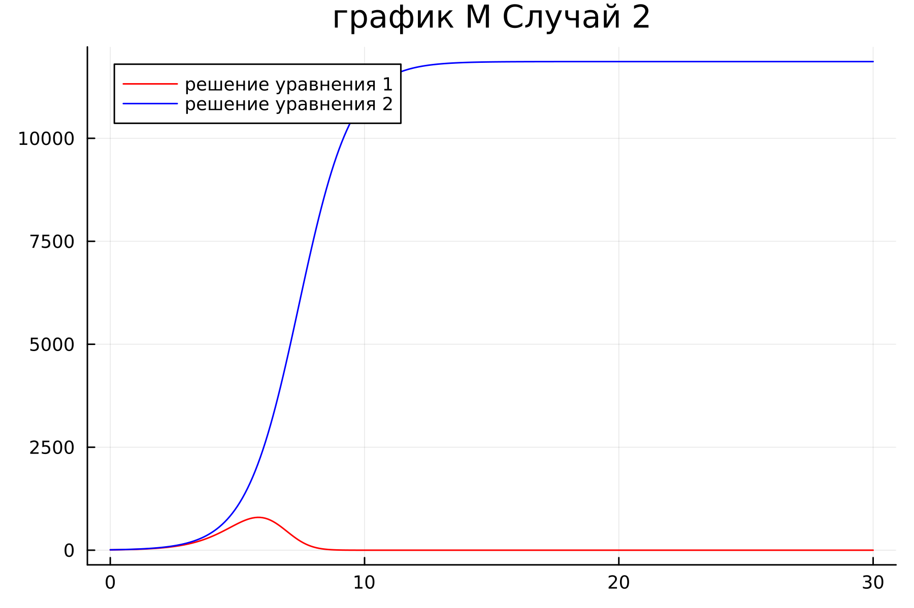
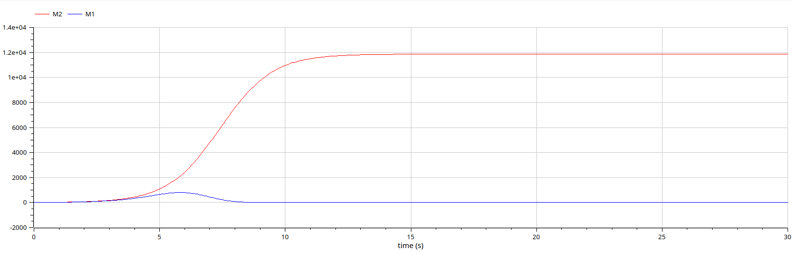

---
## Front matter
lang: ru-RU
title: Презентация к лабораторной работе  7
subtitle: Простейший шаблон
author:
  - Еленга Невлора Люглеш.
institute:
  - Российский университет дружбы народов, Москва, Россия
  - Факультет физико-математических и естественных наук, Москва, Россия
date: 22 март 2023

## i18n babel
babel-lang: russian
babel-otherlangs: english

## Formatting pdf
toc: false
toc-title: Содержание
slide_level: 2
aspectratio: 169
section-titles: true
theme: metropolis
header-includes:
 - \metroset{progressbar=frametitle,sectionpage=progressbar,numbering=fraction}
 - '\makeatletter'
 - '\beamer@ignorenonframefalse'
 - '\makeatother'
---

# Информация

## Докладчик

:::::::::::::: {.columns align=center}
::: {.column width="70%"}

  * Еленга Невлора Люглеш
  * Студент 3-го курса
  * Группа НКНбд-01-20
  * Российский университет дружбы народов
  * 1032205073
  * <https://github.com/Newlora501>

# Вводная часть

## Актуальность
Конкуренция – это элемент рыночного механизма, форма взаимодействия рыночных субъектов, их экономического соперничества за наиболее выгодные условия производства, купли и продажи товаров, условия предложения капитала, источники сырья, рынки сбыта и др.

Для построения модели конкуренции хотя бы двух фирм необходимо рассмотреть модель одной фирмы. Вначале рассмотрим модель фирмы, производящей продукт долговременного пользования, когда цена его определяется балансом спроса и предложения. Примем, что этот продукт занимает определенную нишу рынка и конкуренты в ней отсутствуют.

## Цели 
- Рассмотреть две фирмы, производящие взаимозаменяемые товары одинакового качества и находящиеся в одной рыночной нише

- Рассмотреть модель, когда, помимо экономического фактора влияния, используются еще и социально-психологические факторы – формирование общественного предпочтения одного товара другому, не зависимо от их качества и цены

- Построить графики изменения оборотных средств фирмы 1 и фирмы 2 без учета постоянных издержек и с веденной нормировкой для случая 1

- Построить графики изменения оборотных средств фирмы 1 и фирмы 2 без учета постоянных издержек и с веденной нормировкой для случая 2

## Задачи

- Случай 1. Рассмотрим две фирмы, производящие взаимозаменяемые товары
одинакового качества и находящиеся в одной рыночной нише. Считаем, что в рамках
нашей модели конкурентная борьба ведётся только рыночными методами. То есть,
конкуренты могут влиять на противника путем изменения параметров своего
производства: себестоимость, время цикла, но не могут прямо вмешиваться в
ситуацию на рынке («назначать» цену или влиять на потребителей каким-либо иным
способом.) Будем считать, что постоянные издержки пренебрежимо малы, и в
модели учитывать не будем. В этом случае динамика изменения объемов продаж
фирмы 1 и фирмы 2 описывается следующей системой уравнений:$$ \frac{\partial M_1}{\partial\theta}=M_1-\frac{b}{c_1}M_1M_2-\frac{a_1}{c_1}M_1^2;\frac{\partial M_2}{\partial\theta}=\frac{c_2}{c_1}M_2-\frac{b}{c_1}M_1M_2- \frac{a_2}{c_1}M_2^2 $$ где $$ a_1=\frac{p_{cr}}{\tau_1^2\tilde{p}_1^2Nq},a_2=\frac{p_{cr}}{\tau_2^2\tilde{p}_2^2Nq},b=\frac{p_{cr}}{\tau_1^2\tilde{p}_1^2\tau_2^2\tilde{p}_2^2Nq},c_1=\frac{p_{cr}-\tilde{p}_1}{\tau_1\tilde{p}_1},c_2=\frac{p_{cr}-\tilde{p}_2}{\tau_2\tilde{p}_2}$$ Также введена нормировка $$ t=c_1\theta $$

- Случай 2. Рассмотрим модель, когда, помимо экономического фактора
влияния (изменение себестоимости, производственного цикла, использование
кредита и т.п.), используются еще и социально-психологические факторы –
формирование общественного предпочтения одного товара другому, не зависимо от
их качества и цены. В этом случае взаимодействие двух фирм будет зависеть друг
от друга, соответственно коэффициент перед
$$ M_1M_2 $$
будет отличаться. Пусть в
рамках рассматриваемой модели динамика изменения объемов продаж фирмы 1 и
фирмы 2 описывается следующей системой уравнений:$$ \frac{\partial M_1}{\partial \theta}=M_1-(\frac{b}{c_1}+0.00044)M_1M_2-\frac{a_1}{c_1}M_1^2;\frac{\partial M_2}{\partial\theta}=\frac{c_2}{c_1}M_2-\frac{b}{c_1}M_1M_2-\frac{a_2}{c_1}M_2^2 $$ Для обоих случаев рассмотрим задачу со следующими начальными условиями и параметрами: $$ M_0^1=7.7,M_0^2=9.7,p_{cr}=47,N=50,q=1,\tau_1=33,\tau_2=27,\tilde{p}_1=9.7,\tilde{p}_2=11.7 $$ **Замечание: **Значения $$ p_{cr},\tilde{p}_1,_2,N $$ указаны в тысячах единиц, а значения $$ M_1,_2 $$ указаны в млн. единиц.

Обозначения:$$ N $$– число потребителей производимого продукта $$ \tau $$ – длительность производственного цикла $$ p $$– рыночная цена товара $$ \tilde{p} $$ – себестоимость продукта, то есть переменные издержки на производство единицы продукции $$ q $$ – максимальная потребность одного человека в продукте в единицу времени $$ \theta=\frac{t}{c_1} $$ – безразмерное время

1.Постройте графики изменения оборотных средств фирмы 1 и фирмы 2 без учета постоянных издержек и с веденной нормировкой для случая 1.

2.Постройте графики изменения оборотных средств фирмы 1 и фирмы 2 без учета постоянных издержек и с веденной нормировкой для случая 2.

## Содержание исследования

- Рассмотреть модель конкуренции двух фирм

- Научиться строить графики изменения оборотных средств с помощью OpenModelica

- Применение полученных знаний на практике в дальнейшем

## Полученные график
### 1) Решение для случая 1 
- Julia
{#fig:001 width=70%}
- Openmodelica
{#fig:002 width=70%}

По графику видно, что рост оборотных средств предприятий идет независимо друг от друга. Каждая фирма достигает свое максимальное значение объема продаж и остается на рынке с этим значением, то есть каждая фирма захватывает свою часть рынка потребителей, которая не изменяется.

### 2) Решение для случая 2
- Julia
{#fig:003 width=70%}
- Openmodelica
{#fig:004 width=70%}

По графику видно, что фирма M2, несмотря на начальный рост, достигнув своего максимального объема продаж, начитает нести убытки и, в итоге, терпит банкротство. Динамика роста объемов оборотных средств фирмы M1 остается без изменения: достигнув максимального значения, остается на этом уровне.

## Результаты

- Мы научились работать в OpenModelica

- Рассмотрели модель конкуренции двух фирм в разных случаях

- Построили графики изменения оборотных средств и проанализировали их.

## Итоговый слайд

- СПАСИБО ЗА ВИНИМАНИЕ
