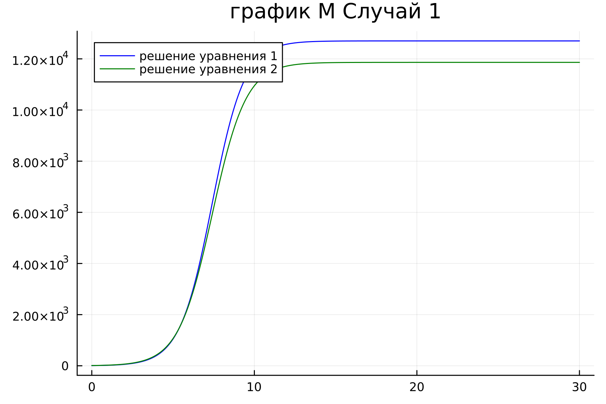
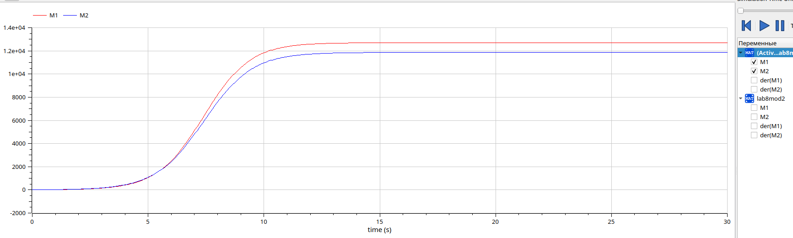
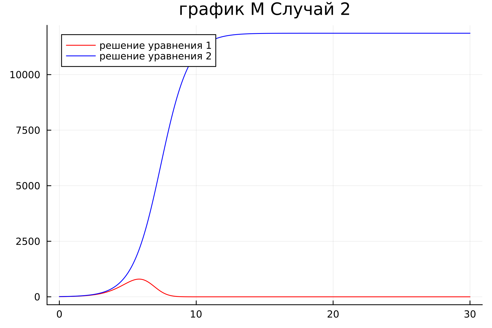
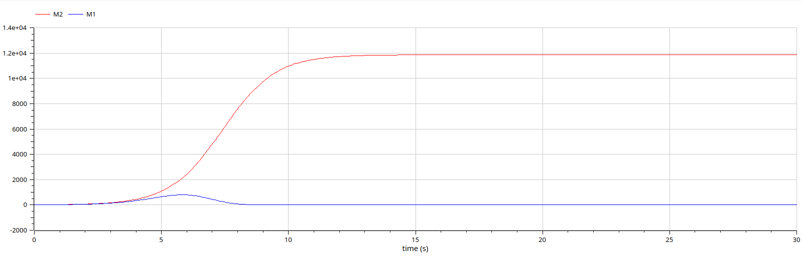

---
## Front matter
title: "Отчёт по лабораторной работе 8"
subtitle: "Простейший вариант 54"
author: "Еленга Невлора Люглеш"

## Generic otions
lang: ru-RU
toc-title: "Содержание"

## Bibliography
bibliography: bib/cite.bib
csl: pandoc/csl/gost-r-7-0-5-2008-numeric.csl

## Pdf output format
toc: true # Table of contents
toc-depth: 2
lof: true # List of figures
lot: true # List of tables
fontsize: 12pt
linestretch: 1.5
papersize: a4
documentclass: scrreprt
## I18n polyglossia
polyglossia-lang:
  name: russian
  options:
	- spelling=modern
	- babelshorthands=true
polyglossia-otherlangs:
  name: english
## I18n babel
babel-lang: russian
babel-otherlangs: english
## Fonts
mainfont: PT Serif
romanfont: PT Serif
sansfont: PT Sans
monofont: PT Mono
mainfontoptions: Ligatures=TeX
romanfontoptions: Ligatures=TeX
sansfontoptions: Ligatures=TeX,Scale=MatchLowercase
monofontoptions: Scale=MatchLowercase,Scale=0.9
## Biblatex
biblatex: true
biblio-style: "gost-numeric"
biblatexoptions:
  - parentracker=true
  - backend=biber
  - hyperref=auto
  - language=auto
  - autolang=other*
  - citestyle=gost-numeric
## Pandoc-crossref LaTeX customization
figureTitle: "Рис."
tableTitle: "Таблица"
listingTitle: "Листинг"
lofTitle: "Список иллюстраций"
lotTitle: "Список таблиц"
lolTitle: "Листинги"
## Misc options
indent: true
header-includes:
  - \usepackage{indentfirst}
  - \usepackage{float} # keep figures where there are in the text
  - \floatplacement{figure}{H} # keep figures where there are in the text
---

# Цель работы
Рассмотреть модель конкуренции двух фирм. Построить графики изменения оборотных средств.

# Теоретическая справка
1. Модель одной фирмы

Для построения модели конкуренции хотя бы двух фирм необходимо рассмотреть модель одной фирмы. Вначале рассмотрим модель фирмы, производящей продукт долговременного пользования, когда цена его определяется балансом спроса и предложения. Примем, что этот продукт занимает определенную нишу рынка и конкуренты в ней отсутствуют. Обозначим: $$ N $$ – число потребителей производимого продукта. $$ S $$ – доходы потребителей данного продукта. Считаем, что доходы всех потребителей одинаковы. Это предположение справедливо, если речь идет об одной рыночной нише, т.е. производимый продукт ориентирован на определенный слой населения. $$ M $$ – оборотные средства предприятия. $$ \tau $$ – длительность производственного цикла. $$ p $$ – рыночная цена товара. $$ \tilde{p} $$ – себестоимость продукта, то есть переменные издержки на производство единицы продукции. $$ \delta $$ – доля оборотных средств, идущая на покрытие переменных издержек. $$ \kappa $$ – постоянные издержки, которые не зависят от количества выпускаемой продукции. $$ Q(S/p) $$ – функция спроса, зависящая от отношения дохода S к цене p. Она равна количеству продукта, потребляемого одним потребителем в единицу времени.

Функцию спроса товаров долговременного использования часто представляют в простейшей форме: $$ \tag{1}Q=q-k\frac{P}{S}=q(1-\frac{p}{p_{cr}}) $$ где q – максимальная потребность одного человека в продукте в единицу времени.

Эта функция падает с ростом цены и при $$ p=p_{cr} $$ (критическая стоимость продукта)потребители отказываются от приобретения товара. Величина $$ p_{cr}=Sq/k $$ Параметр k – мера эластичности функции спроса по цене. Таким образом, функция спроса в форме (1) является пороговой, то есть $$ Q(S/p)=0,p\geq p_{cr} $$ и обладает свойствами насыщения.

Уравнения динамики оборотных средств можно записать в виде $$ \tag{2}\frac{\partial M}{\partial t}=-\frac{M\delta}{\tau}+NQp-\kappa=-\frac{M\delta}{\tau}+NQ(1-\frac{p}{p_{cr}})p-\kappa $$ Уравнение для рыночной цены p представим в виде $$ \tag{3}\frac{\partial p}{\partial t}=\gamma(-\frac{M\delta}{\tau\tilde{p}}+NQ(1-\frac{p}{p_{cr}})) $$ Первый член соответствует количеству поставляемого на рынок товара (то есть, предложению), а второй член – спросу.

Параметр $$ \gamma $$ зависит от скорости оборота товаров на рынке. Как правило, время торгового оборота существенно меньше времени производственного цикла $$ \tau $$ При заданном M уравнение (3) описывает быстрое стремление цены к равновесному значению цены, которое устойчиво.

В этом случае уравнение (3) можно заменить алгебраическим соотношением $$ \tag{4}-\frac{M\delta}{\tau\tilde{p}}+NQ(1-\frac{p}{p_{cr}})=0 $$ Из (4) следует, что равновесное значение цены p равно $$ \tag{5}p=p_{cr}(1-\frac{M\delta}{\tau\tilde{p}Nq}) $$ Уравнение (2) с учетом (5) приобретает вид $$ \tag{6}\frac{\partial M}{\partial t}=M\frac{\delta}{\tau}(\frac{p_{cr}}{\tilde{p}}-1)- M^2(\frac{\delta}{\tau\delta{p}})^2\frac{p_{cr}}{Nq}-\kappa $$ Уравнение (6) имеет два стационарных решения, соответствующих условию: $$ \frac{\partial M}{\partial t}=0 $$
где $$ \tag{8}a=Nq(1-\frac{\tilde{p}}{p_{cr}})\tilde{p}\frac{\tau}{\delta},b =\kappa Nq\frac{(\tau\tilde{p})^2}{p_{cr}\delta^2} $$ Из (7) следует, что при больших постоянных издержках, в случае $$ a^2<4b, $$ стационарных состояний нет. Это означает, что в этих условиях фирма не может функционировать стабильно, то есть, терпит банкротство. Однако, как правило, постоянные затраты малы по сравнению с переменными $$ b<<a^2 $$ и играют роль, только в случае, когда оборотные средства малы. При $$ b<<a $$ стационарные значения M равны $$ \tag{9}\tilde{M}+=Nq\frac{\tau}{\delta}(1-\frac{\tilde{p}}{p{cr}})\tilde{p}, \tilde{M}-=\kappa\tilde{p}\frac{\tau}{\delta(p{cr}-\tilde{p})} $$ Первое состояние $$ \tilde{M}+ $$ устойчиво и соответствует стабильному функционированию предприятия. Второе состояние $$ \tilde{M}- $$ неустойчиво, так что при $$ M<\tilde{M}_- $$ оборотные средства падают $$ \partial M/\partial t<0 $$ то есть, фирма идет к банкротству.

По смыслу $$ \tilde{M}_- $$ соответствует начальному капиталу, необходимому для входа в рынок.

В обсуждаемой модели параметр $$ \delta $$ всюду входит в сочетании с $$ \tau $$ Это значит, что уменьшение доли оборотных средств, вкладываемых в производство, эквивалентно удлинению производственного цикла. Поэтому мы в дальнейшем положим: $$ \delta=1 $$ а параметр $$ \tau $$ будем считать временем цикла, с учётом сказанного.

2. Конкуренция двух фирм

2.1. Случай 1

Рассмотрим две фирмы, производящие взаимозаменяемые товары одинакового качества и находящиеся в одной рыночной нише. Последнее означает, что у потребителей в этой нише нет априорных предпочтений, и они приобретут тот или иной товар, не обращая внимания на знак фирмы. В этом случае, на рынке устанавливается единая цена, которая определяется балансом суммарного предложения и спроса. Иными словами, в рамках нашей модели конкурентная борьба ведётся только рыночными методами. То есть, конкуренты могут влиять на противника путем изменения параметров своего производства: себестоимость, время цикла, но не могут прямо вмешиваться в ситуацию на рынке («назначать» цену или влиять на потребителей каким либо иным способом).

Уравнения динамики оборотных средств запишем по аналогии с (2) в виде $$ \tag{10}\frac{\partial M_1}{\partial t}=-\frac{M_1}{\tau_1}+N_1q(1-\frac{p}{p_{cr}})p-\kappa_1;\frac{\partial M_2}{\partial t}=-\frac{M_2}{\tau_2}+N_2q(1-\frac{p}{p_{cr}})p- \kappa_2 $$ где использованы те же обозначения, а индексы 1 и 2 относятся к первой и второй фирме, соответственно. Величины $$ N_1,N_2 $$ – числа потребителей, приобретших товар первой и второй фирмы.

Учтем, что товарный баланс устанавливается быстро, то есть, произведенный каждой фирмой товар не накапливается, а реализуется по цене p. Тогда $$ \tag{11}\frac{M_1}{\tau_1\tilde{p}1}=N_1q(1-\frac{p}{p{cr}});\frac{M_2}{\tau_2\tilde{p}2}=N_2q(1-\frac{p}{p{cr}}) $$ где $$ \tilde{p}_1,\tilde{p}_2 $$ – себестоимости товаров в первой и второй фирме.

С учетом (10) представим (11) в виде $$ \tag{12}\frac{\partial M_1}{\partial t}=-\frac{M_1}{\tau_1}(1-\frac{p}{\tilde{p}_1})- \kappa_1;\frac{\partial M_2}{\partial t}=-\frac{M_2}{\tau_2}(1-\frac{p}{\tilde{p}_2})- \kappa_2 $$ Уравнение для цены, по аналогии с (3), $$ \tag{13}\frac{\partial p}{\partial t}=-\gamma(\frac{M_1}{\tau_1\tilde{p}1}+\frac{M_2}{\tau_2\tilde{p}2}-Nq(1-\frac{p}{p{cr}}) $$ Считая, как и выше, что ценовое равновесие устанавливается быстро, получим: $$ \tag{14} p=p{cr}(1-\frac{1}{Nq}(\frac{M_1}{\tau_1\tilde{p}_1}+\frac{M_2}{\tau_2\tilde{p}2})) $$ Подставив (14) в (12) имеем: $$ \tag{15}\frac{\partial M_1}{\partial t}=c_1M_1-bM_1M_2-a_1M_1^2-\kappa_1;\frac{\partial M_2}{\partial t}=c_2M_2-bM_1M_2-a_2M_2^2-\kappa_2 $$ где $$ \tag{16}a_1=\frac{p{cr}}{\tau_1^2\tilde{p}1^2Nq},a_2=\frac{p{cr}}{\tau_2^2\tilde{p}2^2Nq},b=\frac{p{cr}}{\tau_1^2\tilde{p}_1^2\tau_2^2\tilde{p}2^2Nq},c_1=\frac{p{cr}-\tilde{p}_1}{\tau_1\tilde{p}1},c_2=\frac{p{cr}-\tilde{p}_2}{\tau_2\tilde{p}_2} $$ Исследуем систему (15) в случае, когда постоянные издержки (κ_1, κ_2) пренебрежимо малы. И введем нормировку $$ t=c_1\theta $$ Получим следующую систему: $$ \tag{17}\frac{\partial M_1}{\partial\theta}=M_1-\frac{b}{c_1}M_1M_2-\frac{a_1}{c_1}M_1^2;\frac{\partial M_2}{\partial\theta}=\frac{c_2}{c_1}M_2-\frac{b}{c_1}M_1M_2-\frac{a_2}{c_1}M_2^2 $$ Чтобы решить систему (17) необходимо знать начальные условия.

2.2. Случай 2

Рассмотрим модель, когда, помимо экономического фактора влияния (изменение себестоимости, производственного цикла, использование кредита и т.п.), используются еще и социально-психологические факторы – формирование общественного предпочтения одного товара другому, не зависимо от их качества и цены. В этом случае взаимодействие двух фирм будет зависеть друг от друга, соответственно коэффициент перед $$ M_1M_2 $$ будет отличаться.

Получим следующую модель: $$ \tag{18}\frac{\partial M_1}{\partial\theta}=M_1-(\frac{b}{c_1}+0,002)M_1M_2-\frac{a_1}{c_1}M_1^2;\frac{\partial M_2}{\partial\theta}=\frac{c_2}{c_1}M_2-\frac{b}{c_1}M_1M_2-\frac{a_2}{c_1}M_2^2 $$

# Задание
Вариант 54

Случай 1. Рассмотрим две фирмы, производящие взаимозаменяемые товары
одинакового качества и находящиеся в одной рыночной нише. Считаем, что в рамках
нашей модели конкурентная борьба ведётся только рыночными методами. То есть,
конкуренты могут влиять на противника путем изменения параметров своего
производства: себестоимость, время цикла, но не могут прямо вмешиваться в
ситуацию на рынке («назначать» цену или влиять на потребителей каким-либо иным
способом.) Будем считать, что постоянные издержки пренебрежимо малы, и в
модели учитывать не будем. В этом случае динамика изменения объемов продаж
фирмы 1 и фирмы 2 описывается следующей системой уравнений:$$ \frac{\partial M_1}{\partial\theta}=M_1-\frac{b}{c_1}M_1M_2-\frac{a_1}{c_1}M_1^2;\frac{\partial M_2}{\partial\theta}=\frac{c_2}{c_1}M_2-\frac{b}{c_1}M_1M_2- \frac{a_2}{c_1}M_2^2 $$ где $$ a_1=\frac{p_{cr}}{\tau_1^2\tilde{p}_1^2Nq},a_2=\frac{p_{cr}}{\tau_2^2\tilde{p}_2^2Nq},b=\frac{p_{cr}}{\tau_1^2\tilde{p}_1^2\tau_2^2\tilde{p}_2^2Nq},c_1=\frac{p_{cr}-\tilde{p}_1}{\tau_1\tilde{p}_1},c_2=\frac{p_{cr}-\tilde{p}_2}{\tau_2\tilde{p}_2}$$ Также введена нормировка $$ t=c_1\theta $$

Случай 2. Рассмотрим модель, когда, помимо экономического фактора
влияния (изменение себестоимости, производственного цикла, использование
кредита и т.п.), используются еще и социально-психологические факторы –
формирование общественного предпочтения одного товара другому, не зависимо от
их качества и цены. В этом случае взаимодействие двух фирм будет зависеть друг
от друга, соответственно коэффициент перед
$$ M_1M_2 $$
будет отличаться. Пусть в
рамках рассматриваемой модели динамика изменения объемов продаж фирмы 1 и
фирмы 2 описывается следующей системой уравнений:$$ \frac{\partial M_1}{\partial \theta}=M_1-(\frac{b}{c_1}+0.00044)M_1M_2-\frac{a_1}{c_1}M_1^2;\frac{\partial M_2}{\partial\theta}=\frac{c_2}{c_1}M_2-\frac{b}{c_1}M_1M_2-\frac{a_2}{c_1}M_2^2 $$ Для обоих случаев рассмотрим задачу со следующими начальными условиями и параметрами: $$ M_0^1=7.7,M_0^2=9.7,p_{cr}=47,N=50,q=1,\tau_1=33,\tau_2=27,\tilde{p}_1=9.7,\tilde{p}_2=11.7 $$ **Замечание: **Значения $$ p_{cr},\tilde{p}_1,_2,N $$ указаны в тысячах единиц, а значения $$ M_1,_2 $$ указаны в млн. единиц.

Обозначения:$$ N $$– число потребителей производимого продукта $$ \tau $$ – длительность производственного цикла $$ p $$– рыночная цена товара $$ \tilde{p} $$ – себестоимость продукта, то есть переменные издержки на производство единицы продукции $$ q $$ – максимальная потребность одного человека в продукте в единицу времени $$ \theta=\frac{t}{c_1} $$ – безразмерное время

1.Постройте графики изменения оборотных средств фирмы 1 и фирмы 2 без учета постоянных издержек и с веденной нормировкой для случая 1.

2.Постройте графики изменения оборотных средств фирмы 1 и фирмы 2 без учета постоянных издержек и с веденной нормировкой для случая 2.


# Выполнение лабораторной работы
## код
### Решение для случая 1
- Julia
```
using Plots
using DifferentialEquations

p_cr = 47 
N = 50 
q = 1 
tau1 = 33 
tau2 = 27
p1 = 9.7 
p2 = 11.7 
M01 = 7.7
M02 = 9.7

a1 = p_cr/(tau1*tau1*p1*p1*N*q)
a2 = p_cr/(tau2*tau2*p2*p2*N*q)
b = p_cr/(tau1*tau1*tau2*tau2*p1*p1*p2*p2*N*q)
c1 = (p_cr-p1)/(tau1*p1)
c2 = (p_cr-p2)/(tau2*p2)

function ode_f(du, u, p, t)
    m1, m2 = u
    du[1] = (c1/c1)*u[1]-(a1/c1)*u[1]*u[1]-(b/c1)*u[1]*u[2]
    du[2] = (c2/c1)*u[2]-(a2/c1)*u[2]*u[2]-(b/c1)*u[1]*u[2]
end

u0 = [M01, M02]
tspan =(0.0, 30.0)
prob1 = ODEProblem(ode_f, u0, tspan)
sol1 = solve(prob1, dtmax=0.1)

M1 = [u[1] for u in sol1.u]
M2 = [u[2] for u in sol1.u]
T = [t for t in sol1.t]

plt = 
    plot(
        layout=(1),
        dpi=300,
        legend=true)
    plot!(
            plt[1],
            T,
            M1,
            title="график M Случай 1",
            label="решение уравнения 1",
            color=:blue)
    plot!(
            plt[1],
            T,
            M2,
            label="решение уравнения 2",
            color=:green)
        
        savefig("lab8_1.png")
```
{#fig:001 width=70%}

- Openmodelica
```
model lab8mod1
constant Real N=50;
constant Real q=1;
constant Real p_cr=47;
constant Real p1=9.7;
constant Real p2=11.7;
constant Real tau1=33;
constant Real tau2=27;
constant Real a1 = p_cr/(tau1*tau1*p1*p1*N*q);
constant Real a2 = p_cr/(tau2*tau2*p2*p2*N*q); 
constant Real b = p_cr/(tau1*tau1*tau2*tau2*p1*p1*p2*p2*N*q); 
constant Real c1 = (p_cr-p1)/(tau1*p1); 
constant Real c2 = (p_cr-p2)/(tau2*p2); 

Real M1;
Real M2;

initial equation
M1=7.7;
M2=9.7;

equation
der(M1)=M1-(b/c1)*M1*M2-(a1/c1)*M1*M1;
der(M1)=(c2/c1)*M2-(b/c1)*M1*M2-(a2/c1)*M2*M2;

end lab8mod1;
```
{#fig:002 width=70%}


По графику видно, что рост оборотных средств предприятий идет независимо друг от друга. Каждая фирма достигает свое максимальное значение объема продаж и остается на рынке с этим значением, то есть каждая фирма захватывает свою часть рынка потребителей, которая не изменяется.


### Решение для случая 2
- Julia
```
using Plots
using DifferentialEquations

p_cr = 47 
N = 50 
q = 1 
tau1 = 33 
tau2 = 27
p1 = 9.7 
p2 = 11.7 
M01 = 7.7
M02 = 9.7

a1 = p_cr/(tau1*tau1*p1*p1*N*q)
a2 = p_cr/(tau2*tau2*p2*p2*N*q)
b = p_cr/(tau1*tau1*tau2*tau2*p1*p1*p2*p2*N*q)
c1 = (p_cr-p1)/(tau1*p1)
c2 = (p_cr-p2)/(tau2*p2)


function ode_f(du, u, p, t)
    m1, m2 = u
    du[1] = (c1/c1)*u[1]-(a1/c1)*u[1]*u[1]-((b/c1)+0.00044)*u[1]*u[2]
    du[2] = (c2/c1)*u[2]-(a2/c1)*u[2]*u[2]-(b/c1)*u[1]*u[2]
end

u0 = [M01, M02]
tspan =(0.0, 30.0)
prob1 = ODEProblem(ode_f, u0, tspan)
sol1 = solve(prob1, dtmax=0.1)

M1 = [u[1] for u in sol1.u]
M2 = [u[2] for u in sol1.u]
T = [t for t in sol1.t]

plt = 
    plot(
        layout=(1),
        dpi=300,
        legend=true)
    plot!(
            plt[1],
            T,
            M1,
            title="график M Случай 2",
            label="решение уравнения 1",
            color=:red)
    plot!(
            plt[1],
            T,
            M2,
            label="решение уравнения 2",
            color=:blue)

         savefig("lab8_2.png")
```
{#fig:003 width=70%}

- Openmodelica
```
model lab8mod2
constant Real N=50;//число потребителей производимого продукта
constant Real q=1;//максимальная потребность одного человека в продукте в единицу времени
constant Real p_cr=47;//критическая стоимость продукта
constant Real p1=9.7;//себестоимость продукта (переменные издержки на производство единицы продукции) фирмы 1
constant Real p2=11.7;//себестоимость продукта (переменные издержки на производство единицы продукции) фирмы 2
constant Real tau1=33;//длительность производственного цикла фирмы 1
constant Real tau2=27;//длительность производственного цикла фирмы 2
constant Real a1=p_cr/(tau1*tau1*p1*p1*N*q);
constant Real a2=p_cr/(tau2*tau2*p2*p2*N*q);
constant Real b=p_cr/(tau1*tau1*tau2*tau2*p1*p1*p2*p2*N*q);
constant Real c1=(p_cr-p1)/(tau1*p1);
constant Real c2=(p_cr-p2)/(tau2*p2);

Real M1;//оборотные средства предприятия фирмы 1
Real M2;//оборотные средства предприятия фирмы 2

initial equation 
M1=7.7;//начальное условие M1
M2=9.7;//начальное условие M2

equation
der(M1)=M1-((b/c1)+0.00044)*M1*M2-(a1/c1)*M1*M1;
der(M2)=(c2/c1)*M2-(b/c1)*M1*M2-(a2/c1)*M2*M2;

end lab8mod2;
``` 
{#fig:004 width=70%}


По графику видно, что фирма M2, несмотря на начальный рост, достигнув своего максимального объема продаж, начитает нести убытки и, в итоге, терпит банкротство. Динамика роста объемов оборотных средств фирмы M1 остается без изменения: достигнув максимального значения, остается на этом уровне.


# Выводы
В ходе выполнения лабораторной работы я рассмотрела модель конкуренции двух фирм. Построила графики изменения оборотных средств и проанализировала их.

# Список литературы

Кулябов Д. С. Лабораторная работа №7:
https://esystem.rudn.ru/pluginfile.php/1971582/mod_resource/content/2/%D0%9B%D0%B0%D0%B1%D0%BE%D1%80%D0%B0%D1%82%D0%BE%D1%80%D0%BD%D0%B0%D1%8F%20%D1%80%D0%B0%D0%B1%D0%BE%D1%82%D0%B0%20%E2%84%96%206.pdf

